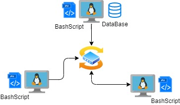

## Introduction

In this project we are asked to record the hardware specification of each node
and monitor each node resource, e.g. CPU/Memory usage, in real time, in a Linux
cluster of 10 nodes/servers connected through a switch. All data are saved in an
RDBMS database.

Here we are going to implement an `MVP` (minimum viable product) to present an initial
version of our final product. In this prototype, we run our program on one node-
instead of a cluster of 10 nodes. We use `bash script` to implement the program and
the PostgreSQL database.

Finally we are going to write SQL queries to answer sum questions, su ss;
> What is average Memory usage (%) over 1-min interval     

## Architecture and Design
The Cluster diagram with three Linux hosts, a DB, and bash agents is as follows;

Two tables show the hardware info and resource usage seperately.

Two bash scrips are used in this project. One for collecting the host hardware info,
and the other for collecting host CPU & Memory resource usage every minute. Both bash scripts insert their data
to the database.

## Usage
1) database and tables (e.g. ddl.sql): One table collects hardware info and the other one collects CPU & Memory usage in real time
2) `host_info.sh` : The bash program collecting hardware info and then sending it to the database
3) `host_usage.sh`: The bash program collecting resource usage and sending it to the database  
4) crontab setup: The `host_usage.sh` is triggered every minute by `crontab`

## Future Improvements
> handle hardware update
